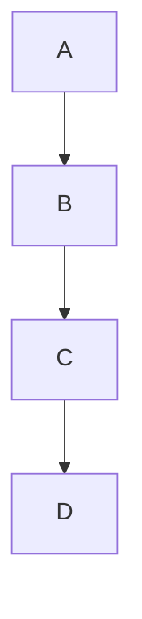
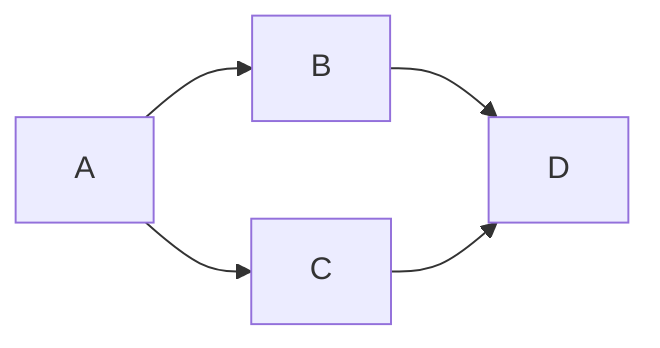
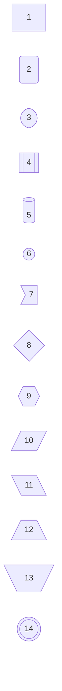

# MermaidExamples

https://mermaid.js.org/

https://mermaid.js.org/syntax/flowchart.html?id=flowcharts-basic-syntax

```mermaid
graph TD;
A --> B;
B --> C;
C --> D;
```

```mermaid
flowchart LR
A --> B
A --> C
B --> D
C --> D
```

```mermaid
flowchart LR
id1[1]
id2(2)
id3([3])
id4[[4]]
id5[(5)]
id6((6))
id7>7]
id8{8}
id9{{9}}
id10[/10/]
id11[\11\]
id12[/12\]
id13[\13/]
id14(((14)))
```

